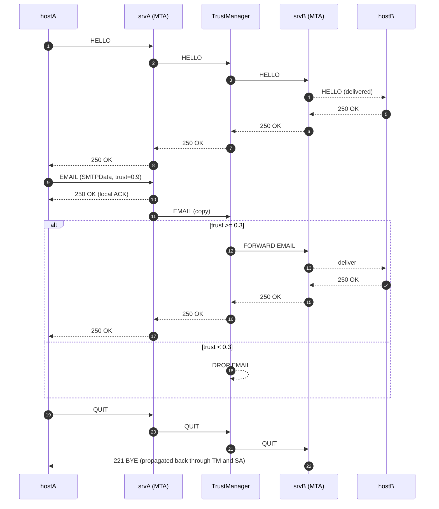

Trust-Aware SMTP Relay Simulation (OMNeT++)

A minimal, teachable OMNeT++ model of a trust‑aware SMTP relay. Two clients send mail via their local servers; a central TrustManager acts as an inter‑server gateway that filters only email content by trust score while forwarding SMTP commands/responses transparently.

✨ Key Features
- Realistic relay chain: `hostA → srvA → TrustManager → srvB → hostB` (and reverse)
- Trust filtering applied only to email payloads (`SMTPData`)
- Protocol transparency for commands/responses (HELLO/QUIT and 250/221)
- Deterministic, indexed routing for clear visualization and tracing
- Compact statistics (scalars/vectors) for post‑run analysis

🏗️ Architecture
```
(hostA) ──▶ (srvA) ──▶ (TrustManager) ──▶ (srvB) ──▶ (hostB)
   ▲                                                ▼
   └────────────────────────── responses ───────────┘
```

🧭 Sequence Diagram (Mermaid)
> GitHub renders Mermaid automatically.



🔎 Trust Policy
- Threshold: `*.tm.dropThreshold` (default `0.3`)
- Forward EMAIL if `trustScore >= threshold`, else DROP
- Commands/responses are always forwarded (protocol‑safe)

📦 Message Types
- `SMTPCommand {command, parameter, clientId, trustScore}`
- `SMTPResponse {code, statusText, success}`
- `SMTPData {from, to, subject, body, sizeBytes, trustScore, msgId}`

📁 Project Layout
```
src/
  SMTPHost.ned        # Topology & wiring
  SMTPClient.cc       # Client state machine (HELLO → EMAIL → QUIT)
  SMTPServer.cc       # Server ACK to client + relay to TM
  TrustManager.cc     # Gateway trust filter (EMAIL only)
  TrustSMTP.msg       # Message definitions (→ TrustSMTP_m.h/.cc)
  TrustSMTP_m.h/.cc   # Generated message classes
  Makefile            # Build rules
simulations/
  omnetpp.ini         # Parameters (trust threshold, intervals, UI)
Makefile              # Root build
```

## ⚙️ Build & Run
From the OMNeT++ shell:
```bash
cd src
make clean && make
cd ../simulations
../src/peyal.exe -u Qtenv -c Qtenv omnetpp.ini
```

🔧 Parameters (omnetpp.ini)
```ini
*.tm.dropThreshold = 0.3
*.hostA.initialTrustScore = 0.9
*.hostA.sendInterval = 4s
*.hostB.initialTrustScore = 0.2
*.hostB.sendInterval = 2s
```
- Change these to experiment (no rebuild needed for INI changes).

🧠 How It Works (one run)
- Client starts session on a timer → HELLO → EMAIL → QUIT
- Server instantly ACKs EMAIL to client and relays a copy to TM
- TM decides: forward (high trust) or drop (low trust)
- Delivery response (250) flows back along the reverse path

📊 Results
- Per server: `numReceived`, `numCommands`, `numEmails`, `bytesReceived`
- TrustManager: `numReceived`, `numDropped`, `numForwarded`, `numCommands`, `numEmails`
- View in OMNeT++ Result Analysis or export from `results/`

🖼️ Screenshots (optional)
- Qtenv topology view
- Event log snippet (HELLO/EMAIL/QUIT)
- Result plots (scalars/vectors)

🗂️ License
LGPL (OMNeT++ sample licensing).


